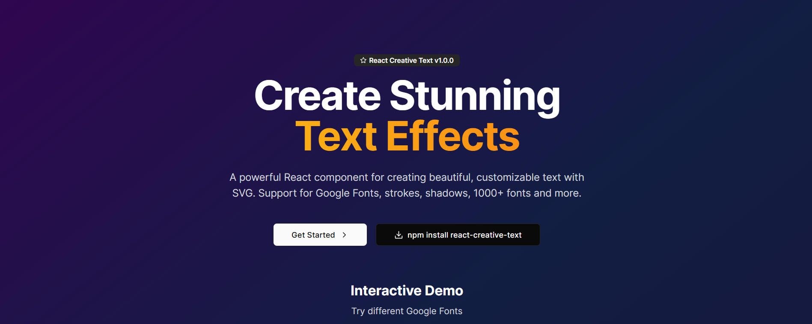

# React Creative Text

<div align="center">
  
  

  [](https://badge.fury.io/js/react-creative-text)
  [](https://www.npmjs.com/package/react-creative-text)
  [](https://opensource.org/licenses/MIT)
  [](https://www.typescriptlang.org/)

  [📖 Documentation](https://react-creative-text-docs.vercel.app/) • [🎮 Live Demo](https://react-creative-text-docs.vercel.app/examples) • [🚀 Getting Started](https://react-creative-text-docs.vercel.app/getting-started)
</div>

---

## ✨ Features

- 🎨 **Rich Customization** - Full control over colors, strokes, shadows, and typography
- 🔤 **Google Fonts Integration** - Seamlessly load and use any Google Font family
- ⚡ **TypeScript Ready** - Built with TypeScript for excellent developer experience
- 📱 **Responsive Design** - SVG-based rendering that scales perfectly
- 🎯 **Zero Dependencies** - Lightweight with no external dependencies
- 🔧 **Easy to Use** - Simple API with sensible defaults
- 🎪 **Creative Effects** - Drop shadows, strokes, and custom styling options

## 🚀 Quick Start

### Installation

```bash
# npm
npm install react-creative-text

# yarn
yarn add react-creative-text

# pnpm
pnpm add react-creative-text
```

### Basic Usage

```jsx
import CreativeText from 'react-creative-text';

function App() {
  return (
    <CreativeText
      fontFamily="Pacifico"
      fontSize="72px"
      color="white"
      strokeColor="black"
      strokeWidth={8}
      shadow={true}
    >
      Hello World!
    </CreativeText>
  );
}
```

## 🎨 Examples

### Neon Glow Effect
```jsx
<CreativeText
  fontFamily="Righteous"
  fontSize="80px"
  color="#00ff88"
  strokeColor="#004d2a"
  strokeWidth={4}
  shadow={true}
>
  NEON GLOW
</CreativeText>
```

### Retro Style
```jsx
<CreativeText
  fontFamily="Fredoka One"
  fontSize="70px"
  color="#ff6b35"
  strokeColor="#2c1810"
  strokeWidth={6}
  shadow={true}
>
  RETRO
</CreativeText>
```

### Ocean Wave
```jsx
<CreativeText
  fontFamily="Pacifico"
  fontSize="65px"
  color="#4fc3f7"
  strokeColor="#01579b"
  strokeWidth={5}
  shadow={true}
>
  Ocean Wave
</CreativeText>
```

### Fire Effect
```jsx
<CreativeText
  fontFamily="Bungee"
  fontSize="75px"
  color="#ff5722"
  strokeColor="#b71c1c"
  strokeWidth={7}
  shadow={true}
>
  FIRE
</CreativeText>
```

## 📋 API Reference

### Props

| Prop | Type | Default | Description |
|------|------|---------|-------------|
| `children` | `string` | **Required** | The text content to display |
| `fontFamily` | `string` | `"Pacifico"` | Google Font family name |
| `fontSize` | `number \| string` | `"72px"` | Size of the text (CSS units) |
| `color` | `string` | `"white"` | Fill color of the text |
| `strokeColor` | `string` | `"black"` | Stroke/outline color |
| `strokeWidth` | `number` | `8` | Width of the text stroke in pixels |
| `shadow` | `boolean` | `true` | Whether to apply drop shadow |
| `className` | `string` | `""` | Additional CSS classes |

### TypeScript Interface

```typescript
interface CreativeTextProps {
  children: string;
  fontFamily?: string;
  fontSize?: number | string;
  color?: string;
  strokeColor?: string;
  strokeWidth?: number;
  shadow?: boolean;
  className?: string;
}
```

## 🎯 Popular Google Fonts

Here are some popular Google Fonts that work great with React Creative Text:

- **Display Fonts**: Righteous, Fredoka One, Bungee, Monoton
- **Script Fonts**: Pacifico, Dancing Script, Great Vibes, Kaushan Script
- **Decorative**: Creepster, Permanent Marker, Shadows Into Light
- **Bold**: Lobster, Oswald, Bebas Neue, Anton

## 🔧 Advanced Usage

### Custom Styling with CSS Classes

```jsx
<CreativeText
  fontFamily="Bungee"
  fontSize="60px"
  color="#ff6b6b"
  strokeColor="#2c2c2c"
  strokeWidth={4}
  className="my-custom-text"
>
  Styled Text
</CreativeText>
```

```css
.my-custom-text {
  transform: rotate(-5deg);
  transition: transform 0.3s ease;
}

.my-custom-text:hover {
  transform: rotate(0deg) scale(1.1);
}
```

### Responsive Text Sizes

```jsx
<CreativeText
  fontFamily="Righteous"
  fontSize="clamp(2rem, 8vw, 6rem)"
  color="#4a90e2"
  strokeColor="#2c3e50"
  strokeWidth={3}
>
  Responsive Text
</CreativeText>
```

### Dynamic Font Loading

The component automatically loads Google Fonts when needed:

```jsx
const [currentFont, setCurrentFont] = useState('Pacifico');

return (
  <div>
    <CreativeText fontFamily={currentFont}>
      Dynamic Font Text
    </CreativeText>
    
    <select onChange={(e) => setCurrentFont(e.target.value)}>
      <option value="Pacifico">Pacifico</option>
      <option value="Righteous">Righteous</option>
      <option value="Bungee">Bungee</option>
    </select>
  </div>
);
```

## 🌟 Use Cases

- **Hero Sections** - Eye-catching headlines and banners
- **Logos & Branding** - Custom text logos with unique styling
- **Gaming UI** - Stylized text for game interfaces
- **Marketing Materials** - Attention-grabbing promotional text
- **Creative Projects** - Artistic text effects for portfolios
- **Social Media Graphics** - Styled text for social posts

## 🛠️ Requirements

- React ^16.8.0 or higher
- Modern browser with SVG support
- TypeScript (optional, but recommended)

## 📱 Browser Support

- ✅ Chrome (latest)
- ✅ Firefox (latest)
- ✅ Safari (latest)
- ✅ Edge (latest)
- ✅ Mobile browsers

## 🤝 Contributing

We welcome contributions! Please see our [Contributing Guide](CONTRIBUTING.md) for details.

1. Fork the repository
2. Create your feature branch (`git checkout -b feature/amazing-feature`)
3. Commit your changes (`git commit -m 'Add some amazing feature'`)
4. Push to the branch (`git push origin feature/amazing-feature`)
5. Open a Pull Request

## 📄 License

This project is licensed under the MIT License - see the [LICENSE](LICENSE) file for details.

## 🙏 Acknowledgments

- Google Fonts for providing amazing typography
- React community for inspiration and support
- SVG specification for making scalable graphics possible

## 📞 Support

- 📖 [Documentation](https://react-creative-text-docs.vercel.app/)
- 🐛 [Issue Tracker](https://github.com/RaviTejaLadi/react-creative-text/issues)
---

<div align="center">
  <p>Made with ❤️ by developers, for developers</p>
  <p>
    <a href="https://react-creative-text-docs.vercel.app">Documentation</a> •
    <a href="https://github.com/RaviTejaLadi/react-creative-text">GitHub</a> •
    <a href="https://www.npmjs.com/package/react-creative-text">npm</a>
  </p>
</div>